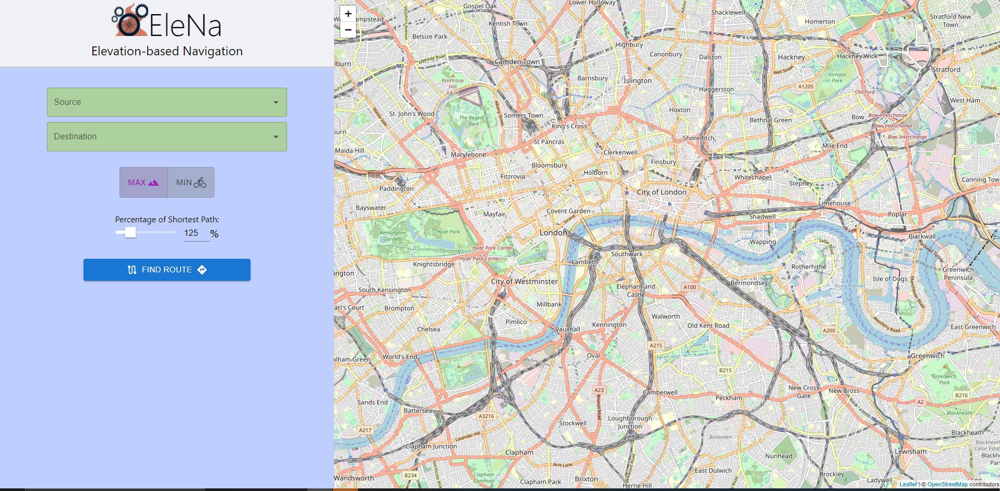
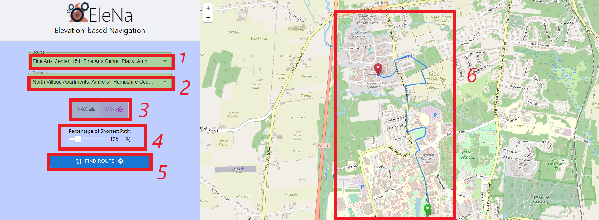

<h1 align="center">Elevation-based Navigation</h1>
EleNa(Elevation-based Navigation) is a routing software that helps users calculate a route based on their preferences. Users are able to choose between getting a route with higher elevation or one with lower elevation. If the user wants a time-constrained workout, they might want a path with the highest elevation. If the user rather go an extra mile to avoid path with a huge elevation gain, then they will want to choose the lower elevation choice.

<!-- TABLE OF CONTENTS -->

## Table of Contents

- [Getting Started](#starting)
- [Contributing](#contribute)
- [Using the Application](#usage)

<!-- GETTING STARTED -->

## Getting Started

To get a local copy up and running follow these steps.

1. git clone the repo
2. cd Elena/elena-frontend
3. run 'npm install'
4. run 'npm start' to start up frontend
5. Download Anaconda prompt https://www.anaconda.com/products/individual 
6. Open Anaconda prompt and cd Elena/server
7. run 'conda config --prepend channels conda-forge'
8. run 'conda create -n ox --strict-channel-priority osmnx'
9. run 'conda activate ox'
10. run 'pip install flask'
11. run 'pip install -U flask-cors'
12. run 'python index.py' to startup backend server locally

<!-- Usage -->

## Using the App

### The Interface

When you run 'npm start' in Elena/elena-frontend, this is what you will see.

### Interface specs

1. Click on the box that says "Source" and then type the origin/source address and then press enter. There will be a dropdown menu for the user to choose the exact address. You can input something like "fine arts center" then press enter to get the following options:

2. Click on the box that says "Destination" and type your desired destination. Works the same as the Source input box above.

3. These are two toggle buttons that let's the user choose between getting a path with higher elevation or lower elevation.

4. This slider lets the user determine how much longer the route will be based on the shortest path generated between the two points.

5. This is the final button to press after selecting all the options above. A path based on the selected preferences will be generated.

6. This is how the path will be shown after using the Find Route button.

<!-- CONTRIBUTING -->

## Contributing

For team mates to contribute follow these steps.

2. Add your changes to the staging area (`git add .`)
3. Commit your Changes (`git commit -m "insert commnet about changes"`)
4. Push (`git push`)

